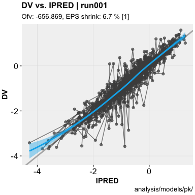
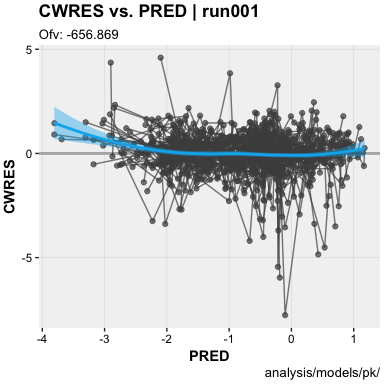

ggxpose <a href="https://guiastrennec.github.io/ggxpose/"></a>
==================================================================================================

[](https://travis-ci.org/guiastrennec/ggxpose) []() [](https://codecov.io/gh/guiastrennec/ggxpose)

### Overview

ggxpose was designed as a [ggplot2](https://github.com/tidyverse/ggplot2)-based alternative to [xpose4](http://xpose.sourceforge.net). ggxpose aims to reduce the post processing burden and improve diagnostics commonly associated the development of non-linear mixed effect models.

### Installation

Install the development version from github

``` r
# install.packages('devtools')
devtools::install_github('guiastrennec/ggxpose')
```

### Getting started

Load ggxpose

``` r
library(ggxpose)
```

Import run output

``` r
xpdb <- xpose_data(runno = '001')
```

Generate diagnostics

``` r
# DV vs. IPRED plot
dv_vs_ipred(xpdb)
```



``` r
# CWRES vs. PRED plot
cwres_vs_pred(xpdb)
```



### Recommended reading

To fully make use of the power of ggxpose, a working knowledge of ggplot2 is recommended. Help for ggplot2 can be found in:

-   The ggplot2 [documentation](http://docs.ggplot2.org/current/)
-   The ggplot2 [mailing list](https://groups.google.com/forum/?fromgroups#!forum/ggplot2)
-   Internet resources (stack overflow, etc.)
