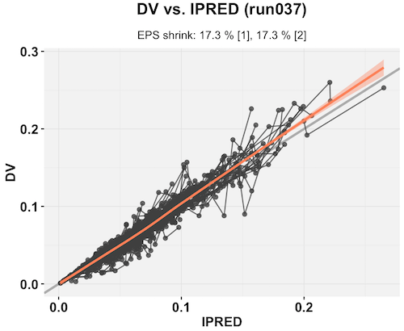
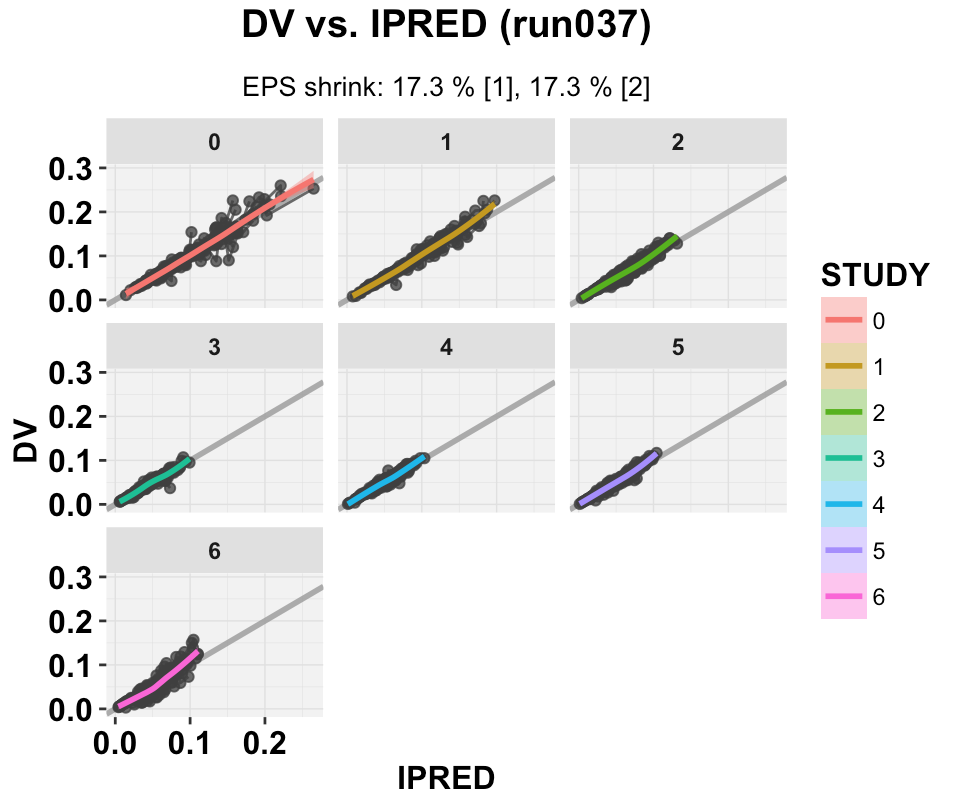
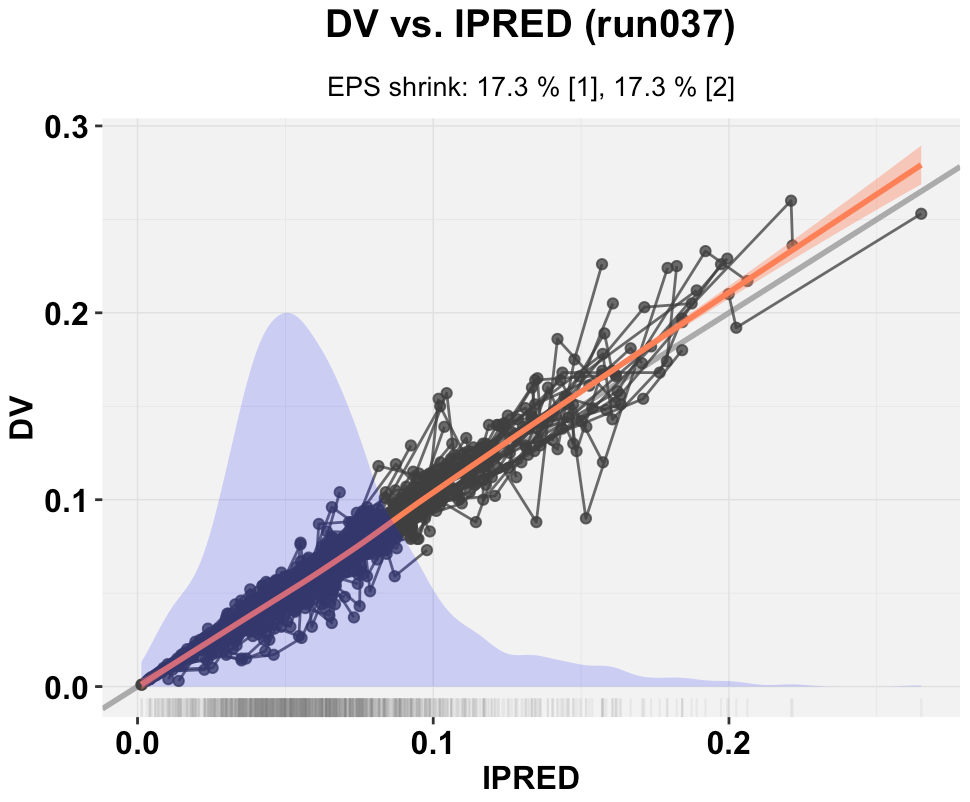

# Warning
This is a "prototype" package and is subject to major change. Your work should not rely on it. We recommend to use [`xpose4`](https://github.com/andrewhooker/xpose4) instead.


# Description
The `ggxpose` package was designed as a ggplot2-based alternative to the lattice-based `xpose4` package. Both`ggxpose` and `xpose4` packages were developped to reduce the post processing burden and provide pharmacometricians by bringing user friendly tools for non-linear mixed effect model building and diagnostics. Both `ggxpose` and `xpose4` are intended to be used along with the NONMEM and [PsN](http://psn.sourceforge.net) softwares.

`ggxpose` was designed to bring  [`ggplot2`](https://github.com/hadley/ggplot2). quality graphs to `xpose` and allow a high level of customization. A working knowledge of the `ggplot2` package is highly recommended.



# Installation

## Install `ggplus` package 
The installation is only required the first time you use the package.
```
devtools::install_github("guiastrennec/ggxpose")
```


## Load `ggxpose` package
Every time you want to use `ggxpose` functions in R.
```
library(ggxpose)
```

# First steps

## Import NONMEM output
The first step is to import the NONMEM output files to R and can be as simple as shown below.
```
xpdb <- xpose_data(runno = '037')
```
This command will look for the run037.lst file in the current directory. The `xpose_data` function gather the all the output tables listed in the lst file under $TABLE (eg. sdtab, cotab, patab) as well as the crutial information from the NONMEM run such as the OFV, ETA and EPS shrinkage. ggxpose makes use of the [`readr`](https://github.com/hadley/readr) package to rapidly import big dataset into R.


## Generating plots
Many functions will be made available in the future. Currently ggxpose only features basic goodness of fit functions such as DV vs. IPRED (`dv_vs_ipred()`) or CWRES vs. PRED (`cwres_vs_time()`). These functions are used as follow:
```
xpose_data(runno = '037') %>% 
dv_vs_ipred()
```
This specific command will dipslay the DV vs. IPRED plot in the preview window of R.


### Plot type
The option `type` allows to control how the data should be represented ie. whether to use points `'p'`, lines `'l'`, smooth `'s'` or any combination of the three (eg. `type = 'pl'`).


### Visual guides
The option `guides` can enable (`TRUE`) or disable (`FALSE`) the visual guides on the graphs such as unity line on the `dv_vs_ipred()` plot or horizontal lines on `cwres_vs_time()`.


### Title and subtitle
`ggxpose` brings a subtitle feature to `ggplot2`. By default `title` and `subtitle` are set to `NULL`. In this case automatic title and subtitle will be used the title will display the name of the plotting function and the run number for example __DV vs. IPRED (run037)__ the subtitle will show additional information such as EPS shrinkage for IPRED based plots. Strings can be provided to `title` and `subtitle` to customize the graph. Finally, both `title` and `subtitle` can be disabled by setting them to `FALSE`.


### Modify aesthetics
As in `ggplot2`, `ggxpose` was designed to make use of aesthetics however additional mapping information was required. Thus to change the color of points one would not use `color = 'red'` but `point_color = 'red'` to avoid lines, smooth and any over layer to become `red` as well. Using this simple mapping one can independently customize the each layer from a single function such as `dv_vs_ipred()`. The mapping is currently defined as `point_xxx`, `line_xxx`, `smooth_xxx`, `guide_xxx`, `xscale_xxx`, `yscale_xxx` where `xxx` can be any option available in the `ggplot2` layers: `geom_point`, `geom_line`, `geom_smooth`, `geom_abline`, `scale_x_continuous`, etc.
```
dv_vs_ipred(xpdb, point_color = 'coral2', guide_alpha = 0.5, line_color = 'blue', line_linetype = 'longdash', smooth_method = 'lm')
```

Aesthetics can also be defined within the `ggplot2` `aes()` function for example one may want to use different point and line color for different subgroups:
```
dv_vs_ipred(xdpb, aes(point_color = STUDY, line_color = STUDY), point_alpha = 0.5)
```


### Grouping variable
The argument group defines the grouping variable to be used in the dataset __for the lines only__, by default group is defined to `'ID'`. To apply a grouping variable on other layers for example a smooth, you can use the following approach:
```
dv_vs_ipred(xpdb, aes(smooth_color = STUDY, smooth_fill = STUDY))

```

In addition the `by` argument can be used to quicky facet according to a given variable.
```
dv_vs_ipred(xpdb, by = STUDY, aes(smooth_color = STUDY, smooth_fill = STUDY))
```




### Additional layers
`ggxpose` offers the opportunity to add additional layers to a plot, for example you could add `geom_rug()` to a plot or an annotation. All layers must be provied as a list object. 

Note: additional layers do not inherit the aesthetic mapping ie. colors or other options need to be defined in each layer as shown below.

```
# Note: this plot is purely demonstrative of the flexibility of ggxpose and is not used for diagnostic purposes.

dv_vs_ipred(xpdb,
            layers = list(geom_density(aes(x = IPRED, ..scaled..*0.2),
                                       fill  = 'blue',
                                       color = NA,
                                       alpha = 0.2,
                                       inherit.aes = FALSE),
                          geom_rug(alpha = 0.1,
                                   color = 'grey50',
                                   sides = 'b',
                                   size = 0.4)))
```



Layers can also be used to modify the aesthetics scales for example  `scale_color_manual()`.


### Scales options
The argument `log` allows to automatically log the axes when set to `TRUE`. Many arguments can be provided to the scales by using the naming convention `xscale_xxx` or `yscale_xxx` where `xxx` is the name of a `ggplot2` scale argument such as `name`, `breaks`, `labels`, `expand`.
```
dv_vs_ipred(xpdb, xscale_breaks = seq(0, 100, 10), 
                  xscale_name = 'Individual model prediction (mg/L)')
```

## Multiple pages
In some cases faceting may result in numerous panels. ggxpose bring the multiple page faceting feature to `ggplot2` through the function `multiple_pages()`. This function works in the spirit of `facet_wrap()` in `ggplot2`, simply define the variable(s) to use for faceting and define the number of rows (`nrow`) and colums (`ncol`). The function will then automatically generate multiple pages according to the given layout.

_Note: this is an experimental feature and it is currently not possible to store the pages in an R object._


## Saving plots
Saving plots in `ggxpose` is very simple, the function `xpose_save()` was designed to automatically save the plot after the name of the run and the `ggxpose` function that was used to generate the plot.
```
xpose_data(runno = '037')
dv_vs_ipred(xpdb) %>% 
  xpose_save()
```
This command would save the graphs DV vs. IPRED under run037_dv_vs_ipred.pdf in the current working directory. Multiple options such as manual name (`name`), the file format (`format = "pdf", "jpg" or "png"`), page size (`width`, `height`) are available.


## Themes
Theme in `ggxpose` are easily customizable. Themes are made up of two parts:   
 - A `ggplot2` (`gg_theme`) theme controling the aspect of the plot window    
 - An `xpose` (`xp_theme`) theme controling the aspect of the layers such as points or lines.

Themes can be attached to an xpdb when importing the data with `xpose_data()`, using the function `xpose_theme()` on an xpdb object or when creating a graph.

```
# xpose_data() example (create the xpdb)
xpdb <- xpose_data(runno = '037', 
                   gg_theme = theme_classic(), 
                   xp_theme = c(point_stroke = 1, 
                                point_shape  = 2))

# xpose_theme() example (update pre-existing xpdb)
xpdb <- xpose_theme(xpdb     = xpdb,
                    gg_theme = theme_bw(),
                    xp_theme = c(point_color = 'dodgerblue4',
                                 line_color  = 'dodgerblue4')) 
                                 
# dv_vs_ipred() example (for a single plot only)
dv_vs_ipred(xpdb = xpdb, 
            gg_theme = theme_dark(), 
            point_color = 'darkblue')
```


## The pipes
`ggxpose` makes use of the pipe operator `%>%`. It can be used to generate clear flow as follows.
```
xpose_data(runno = '037') %>% 
  dv_vs_ipred() %>% 
  xpose_save()
```

