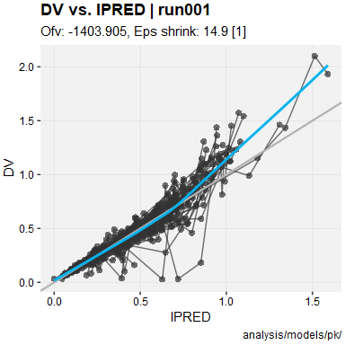
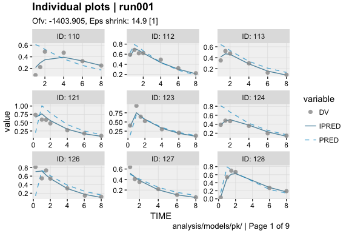
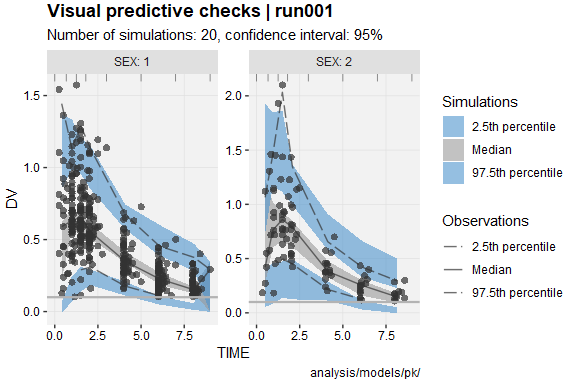
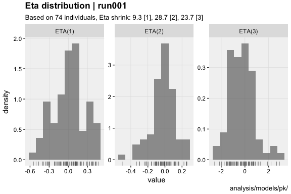
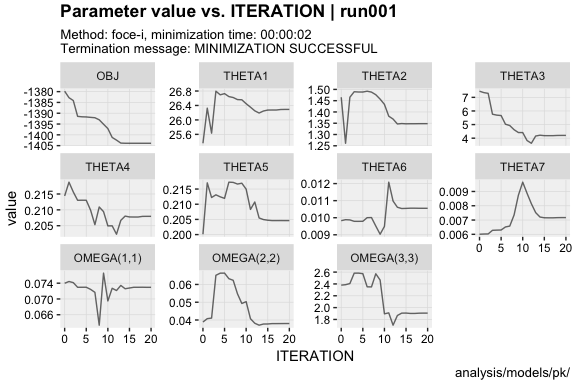

<!-- README.md is generated from README.Rmd. Please edit that file -->
xpose <a href="https://UUPharmacometrics.github.io/xpose/"></a>
===============================================================================================================

[](https://travis-ci.org/UUPharmacometrics/xpose) [](https://ci.appveyor.com/project/guiastrennec/xpose) [](https://CRAN.R-project.org/package=xpose) [](https://codecov.io/gh/UUPharmacometrics/xpose) [](https://www.tidyverse.org/lifecycle/) [](https://CRAN.R-project.org/package=xpose)

Overview
--------

[xpose](https://UUPharmacometrics.github.io/xpose/) was designed as a [ggplot2](https://github.com/tidyverse/ggplot2)-based alternative to [xpose4](http://xpose.sourceforge.net). xpose aims to reduce the post processing burden and improve diagnostics commonly associated the development of non-linear mixed effect models.

Installation
------------

``` r
# Install the lastest release from the CRAN
install.packages('xpose')

# Or install the development version from GitHub
# install.packages('devtools')
devtools::install_github('UUPharmacometrics/xpose')
```

Getting started
---------------

### Load xpose

``` r
library(xpose)
```

### Import run output

``` r
xpdb <- xpose_data(runno = '001')
```

### Glance at the data object

``` r
xpdb
```

    run001.lst overview: 
     - Software: nonmem 7.3.0 
     - Attached files (memory usage 1.4 Mb): 
       + obs tabs: $prob no.1: catab001.csv, cotab001, patab001, sdtab001 
       + sim tabs: $prob no.2: simtab001.zip 
       + output files: run001.cor, run001.cov, run001.ext, run001.grd, run001.phi, run001.shk 
       + special: <none> 
     - gg_theme: theme_readable 
     - xp_theme: theme_xp_default 
     - Options: dir = analysis/models/pk/, quiet = TRUE, manual_import = NULL

#### Model summary

``` r
summary(xpdb, problem = 1)
```


    Summary for problem no. 0 [Global information] 
     - Software                      @software   : nonmem
     - Software version              @version    : 7.3.0
     - Run directory                 @dir        : analysis/models/pk/
     - Run file                      @file       : run001.lst
     - Run number                    @run        : run001
     - Reference model               @ref        : 000
     - Run description               @descr      : NONMEM PK example for xpose
     - Run start time                @timestart  : Mon Oct 16 13:34:28 CEST 2017
     - Run stop time                 @timestop   : Mon Oct 16 13:34:35 CEST 2017

    Summary for problem no. 1 [Parameter estimation] 
     - Input data                    @data       : ../../mx19_2.csv
     - Number of individuals         @nind       : 74
     - Number of observations        @nobs       : 476
     - ADVAN                         @subroutine : 2
     - Estimation method             @method     : foce-i
     - Termination message           @term       : MINIMIZATION SUCCESSFUL
     - Estimation runtime            @runtime    : 00:00:02
     - Objective function value      @ofv        : -1403.905
     - Number of significant digits  @nsig       : 3.3
     - Covariance step runtime       @covtime    : 00:00:03
     - Condition number              @condn      : 21.5
     - Eta shrinkage                 @etashk     : 9.3 [1], 28.7 [2], 23.7 [3]
     - Epsilon shrinkage             @epsshk     : 14.9 [1]
     - Run warnings                  @warnings   : (WARNING 2) NM-TRAN INFERS THAT THE DATA ARE POPULATION.

    Summary for problem no. 2 [Model simulations] 
     - Input data                    @data       : ../../mx19_2.csv
     - Number of individuals         @nind       : 74
     - Number of observations        @nobs       : 476
     - Estimation method             @method     : sim
     - Number of simulations         @nsim       : 20
     - Simulation seed               @simseed    : 221287
     - Run warnings                  @warnings   : (WARNING 2) NM-TRAN INFERS THAT THE DATA ARE POPULATION.
                                                   (WARNING 22) WITH $MSFI AND "SUBPROBS", "TRUE=FINAL" ...

### Generate diagnostics

#### Standard goodness-of-fit plots

``` r
dv_vs_ipred(xpdb)
```



#### Individual plots

``` r
ind_plots(xpdb, page = 1)
```



#### Visual predictive checks

``` r
xpdb %>% 
  vpc_data(stratify = 'SEX', opt = vpc_opt(n_bins = 7, lloq = 0.1)) %>% 
  vpc()
```



#### Distribution plots

``` r
eta_distrib(xpdb, labeller = 'label_value')
```



#### Minimization diagnostics

``` r
prm_vs_iteration(xpdb, labeller = 'label_value')
```



Recommended reading
-------------------

The [xpose website](https://UUPharmacometrics.github.io/xpose/) contains several useful articles to make full use of xpose

When working with xpose, a working knowledge of ggplot2 is recommended. Help for ggplot2 can be found in:

-   The ggplot2 [documentation](http://docs.ggplot2.org/current/)
-   The ggplot2 [mailing list](https://groups.google.com/forum/?fromgroups#!forum/ggplot2)
-   Internet resources (stack overflow, etc.)

Contribute
----------

Please note that the xpose project is released with a [Contributor Code of Conduct](.github/CODE_OF_CONDUCT.md) and [contributing guidelines](.github/CONTRIBUTING.md). By contributing to this project, you agree to abide these.
