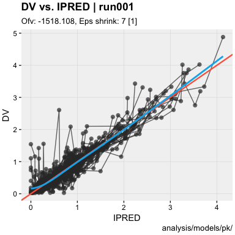
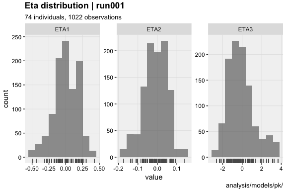
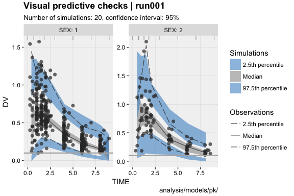

xpose <a href="https://UUPharmacometrics.github.io/xpose/"></a>
===================================================================================================

[](https://travis-ci.org/UUPharmacometrics/xpose) [](https://ci.appveyor.com/project/guiastrennec/xpose)[]() [](https://codecov.io/gh/UUPharmacometrics/xpose)

### Overview

[xpose](https://UUPharmacometrics.github.io/xpose/) was designed as a [ggplot2](https://github.com/tidyverse/ggplot2)-based alternative to [xpose4](http://xpose.sourceforge.net). xpose aims to reduce the post processing burden and improve diagnostics commonly associated the development of non-linear mixed effect models.

### Installation

Install the development version from github

``` r
# install.packages('devtools')
devtools::install_github('UUPharmacometrics/xpose')
```

### Getting started

#### Load xpose

``` r
library(xpose)
```

#### Import run output

``` r
xpdb <- xpose_data(runno = '001')
```

#### Glance at the data object

``` r
xpdb
```

    run001.lst overview: 
     - Software: nonmem 7.3.0 
     - Attached files: 
       + obs tabs: $prob no.1 (modified): catab001.csv, cotab001, patab001, sdtab001 
       + sim tabs: $prob no.2 (modified): simtab001.zip 
       + output files: run001.cor, run001.cov, run001.ext, run001.grd, run001.phi, run001.shk 
       + special: <none> 
     - gg_theme: theme_readable 
     - xp_theme: theme_xp_default 
     - Options: dir = analysis/models/pk/, quiet = TRUE, manual_import = NULL

##### Model summary

``` r
summary(xpdb, problem = 1)
```


    Summary for problem no. 1 [Parameter estimation] 
     - Input data                    @data       : mx19_1.csv
     - Number of individuals         @nind       : 74
     - Number of observations        @nobs       : 1022
     - ADVAN                         @subroutine : 2
     - Estimation method             @method     : foce-i
     - Termination message           @term       : MINIMIZATION SUCCESSFUL
     - Estimation runtime            @runtime    : 00:00:04
     - Objective function value      @ofv        : -1518.108
     - Number of significant digits  @nsig       : 3.6
     - Covariance step runtime       @covtime    : 00:00:04
     - Condition number              @condn      : 6.1
     - Eta shrinkage                 @etashk     : 22 [1], 20.9 [2], 20.5 [3]
     - Epsilon shrinkage             @epsshk     : 7 [1]
     - Run warnings                  @warnings   : (WARNING 2) NM-TRAN INFERS THAT THE DATA ARE POPULATION.

#### Generate diagnostics

##### Standard goodness-of-fit plots

``` r
dv_vs_ipred(xpdb)
```



##### Individual plots

``` r
ind_plots(xpdb, page = 1)
```



##### Distribution plots

``` r
eta_distrib(xpdb)
```



##### Minimization diagnostics

``` r
prm_vs_iteration(xpdb)
```


##### And much more !

### Recommended reading

The [xpose website](https://UUPharmacometrics.github.io/xpose/) contains several useful articles to make full use of xpose

When working with xpose, a working knowledge of ggplot2 is recommended. Help for ggplot2 can be found in:

-   The ggplot2 [documentation](http://docs.ggplot2.org/current/)
-   The ggplot2 [mailing list](https://groups.google.com/forum/?fromgroups#!forum/ggplot2)
-   Internet resources (stack overflow, etc.)
